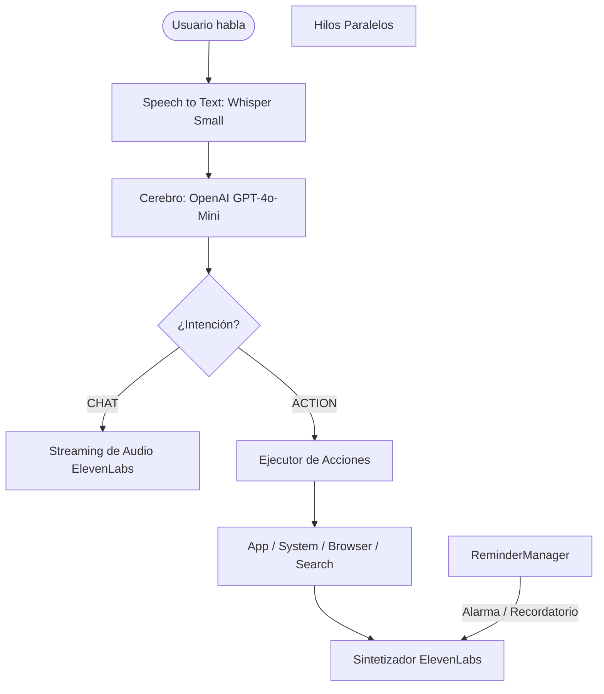

# 🤖 Jarvis AI — Estado Actual (Versión 2.0)

Este documento detalla la arquitectura técnica, las optimizaciones y las capacidades completamente implementadas en **Jarvis AI** hasta el día de hoy. El asistente se ha consolidado como una herramienta premium de alto rendimiento y baja latencia para el control total de Windows.

---

## 🏗️ Arquitectura General del Sistema

El sistema opera bajo una estructura modular de **Procesamiento de Intenciones** y **Ejecutores en Hilos Separados**:

---

## ⚡ Capacidad y Módulos Implementados

### 1. El Cerebro Inteligente (`openai_brain.py`)
*   **Modelo de Lenguaje:** Migrado a `gpt-4o-mini` (OpenAI), logrando respuestas extremadamente rápidas y coherentes.
*   **Prompt de Sistema Optimizado (RAM Caching):** El contenido de `CerebroJarvis.md` se carga en la memoria RAM una sola vez al arrancar. Se eliminaron por completo las lecturas repetitivas a disco en cada frase del usuario, reduciendo drásticamente la latencia inicial.
*   **Memoria a Largo Plazo (`memory.json`):** Jarvis detecta datos clave de forma autónoma (como tu nombre, ubicación, familia o gustos) y los persiste en disco en tiempo real bajo la clave `"save_memory"`.
*   **Memoria a Corto Plazo:** Mantenimiento inteligente del historial de conversación (hasta 10 mensajes) para mantener el contexto del diálogo activo sin inflar el uso de tokens.

### 2. Audio en Streaming de Baja Latencia (`text_to_speech.py`)
*   **Sintetizador Premium:** Conectado a **ElevenLabs** con el modelo optimizado `eleven_turbo_v2_5`.
*   **Pipeline Productor-Consumidor (Streaming):** Jarvis no espera a generar la respuesta completa de texto para hablar. Divide la respuesta en oraciones y las sintetiza de forma asíncrona, reproduciendo el audio casi al instante de terminar tu orden.

### 3. Automatización de Aplicaciones (`app_actions.py`)
*   **Apertura Silenciosa:** Apertura instantánea de navegadores (`Chrome`), terminal (`PowerShell`), IDE (`VS Code`), `Spotify`, `Explorador de Archivos` y más.
*   **Cierre Forzado Seguro:** Implementación de clausura robusta mediante PID (`taskkill`) para cerrar Chrome, Spotify, terminal o VS Code limpiamente diciendo: *"cierra Chrome"*.

### 4. Búsqueda Web en Tiempo Real (`search_actions.py`)
*   **Integración DuckDuckGo:** Búsquedas autónomas en la web mediante la API de `duckduckgo-search` en segundo plano.
*   **Síntesis de Información:** OpenAI digiere los resultados de búsqueda web y te responde por voz de forma resumida en lugar de simplemente abrir el navegador de forma genérica.

### 5. Control Total del Sistema (`system_actions.py`)
*   **Volumen de Audio:** Control de volumen exacto (`set`, `subir`, `bajar`, `mute`, `unmute`) conectándose a la API oficial de Windows mediante la librería `pycaw`.
*   **Brillo de Pantalla:** Control numérico y relativo de luminosidad usando `screen-brightness-control`.
*   **Estadísticas de Hardware:** Consulta en tiempo real del porcentaje de batería, uso de CPU y consumo de memoria RAM (`psutil`).
*   **Gestión de Energía:** Apagado inmediato, reinicio, bloqueo de sesión seguro (`lock`) y cancelación de apagados programados por voz.

### 6. Sistema Inteligente de Recordatorios (`reminders/manager.py`)
*   **Hilo en Background:** Un hilo paralelo chequea en segundo plano de forma silenciosa la lista de alarmas activas.
*   **Recordatorios Relativos:** *"Jarvis, recuérdame tomar agua en 30 minutos"*.
*   **Alarmas Absolutas:** *"Pon una alarma a las 7:30 de la mañana para el gimnasio"*.
*   **Lista y Cancelación:** Consultar recordatorios pendientes y borrarlos todos a petición del usuario.
*   **Acción Proactiva:** Al cumplirse el tiempo, Jarvis te habla de forma proactiva *"Señor, este es su recordatorio..."* sin necesidad de que tú lo actives primero.

### 7. Arranque Automático Silencioso (`iniciar_jarvis.vbs`)
*   **Lanzador Invisible en VBS:** Se eliminó la ventana de consola negra (CMD) y los errores de entorno en el arranque. Windows ahora ejecuta un script VBScript silencioso en segundo plano.
*   **Fijación de Directorio de Trabajo:** La carpeta del proyecto (`D:\CODE\Jarvis`) se inyecta directamente antes de arrancar, garantizando la carga limpia de configuraciones de entorno (`.env`) al encender la laptop.
*   **Briefing de Buenos Días personalizado:** Al iniciar sesión, Jarvis te da los buenos días por voz con la hora, el clima actual y tu nombre de pila, y entra de inmediato en modo de escucha del Wake Word.

---

## 📂 Archivos Clave del Repositorio

*   [main.py](file:///d:/CODE/Jarvis/main.py) — Orquestador central de Jarvis, administrador de eventos y flujo wake-word.
*   [CerebroJarvis.md](file:///d:/CODE/Jarvis/CerebroJarvis.md) — Las instrucciones, personalidad y mapa de acciones normalizadas para OpenAI.
*   [jarvis/brain/openai_brain.py](file:///d:/CODE/Jarvis/jarvis/brain/openai_brain.py) — Cliente del cerebro inteligente y gestión de bases de memoria.
*   [jarvis/speech/text_to_speech.py](file:///d:/CODE/Jarvis/jarvis/speech/text_to_speech.py) — Engine asíncrono para streaming de voz a través de ElevenLabs.
*   [jarvis/reminders/manager.py](file:///d:/CODE/Jarvis/jarvis/reminders/manager.py) — Motor de fondo asíncrono para recordatorios y alarmas.
*   [jarvis/actions/system_actions.py](file:///d:/CODE/Jarvis/jarvis/actions/system_actions.py) — Conector directo a APIs de volumen, brillo, batería y energía.
*   [instalar_inicio_windows.py](file:///d:/CODE/Jarvis/instalar_inicio_windows.py) — Utilidad automática para agregar o quitar a Jarvis del inicio de Windows de forma invisible.
