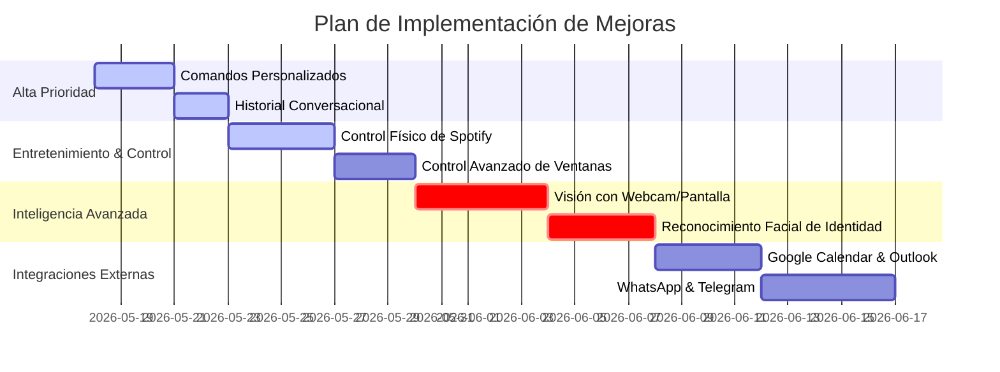

# 🚀 Jarvis AI — Plan de Mejoras Futuras & Roadmap

Este documento establece la visión estratégica, los próximos pasos y el diseño técnico de las funcionalidades más potentes que podemos implementar para llevar a **Jarvis AI** al siguiente nivel de inteligencia y automatización.

---

## 🗺️ Mapa de Ruta del Proyecto (Priorizado)

---

## ⚡ Detalle Técnico de las Siguientes Implementaciones

### 1. Comandos Personalizados (Entrenamiento) ⚡
*   **Concepto:** Permite al usuario entrenar a Jarvis en vivo para ejecutar macros o rutinas complejas agrupando acciones existentes bajo una sola palabra clave.
*   **Ejemplo de uso:**
    *   *Usuario:* *"Jarvis, cuando diga 'modo estudio', abre VS Code, abre Chrome en github.com, pon el volumen al 30% y silencia Spotify."*
    *   *Jarvis:* *"Entendido, señor. Rutina 'modo estudio' guardada."*
*   **Diseño Técnico:**
    *   Se añade la acción `save_custom_macro` al cerebro.
    *   La rutina se guarda de forma estructurada en `memory.json`.
    *   Cuando el usuario dice la palabra clave, el orquestador principal (`main.py`) intercepta el comando y ejecuta la secuencia completa de acciones registradas.

### 2. Historial de Conversaciones Diario (Conversational Logs) 📝
*   **Concepto:** Guarda todas las interacciones de voz y texto entre el usuario y Jarvis en una bitácora diaria organizada por fecha en formato Markdown limpio.
*   **Diseño Técnico:**
    *   Un módulo `Logger` escribe en la carpeta `logs/conversaciones/conversacion_YYYY-MM-DD.md`.
    *   Agrega marcas de tiempo (`[09:30:15]`) e incluye detalles como las intenciones clasificadas y las acciones de sistema que se dispararon.

### 3. Control Real de Reproducción de Spotify 🎵
*   **Concepto:** Controlar activamente la reproducción de música sin depender de presionar teclas multimedia genéricas, permitiendo buscar canciones específicas y controlar playlists.
*   **Ejemplo de uso:** *"Jarvis, pon música de Bad Bunny"*, *"Siguiente canción"*, *"Pausa la música"*, *"Pon la playlist de Chill"*.
*   **Diseño Técnico:**
    *   Integración de la librería `spotipy` (cliente oficial de la API web de Spotify).
    *   Requiere autenticación OAuth2 (el usuario da permisos de control en su cuenta de Spotify una sola vez).
    *   Permite control total de dispositivos activos en la red.

### 4. Visión con Cámara (El factor "WOW") 👁️
*   **Concepto:** Jarvis adquiere la capacidad de "ver" su entorno a través de la webcam o analizar lo que hay en la pantalla actual de Windows utilizando modelos de visión de OpenAI (`gpt-4o`).
*   **Ejemplo de uso:**
    *   *Usuario:* *"Jarvis, ¿qué hay de malo con este error en mi código?"* (Jarvis toma captura de pantalla de VS Code, la analiza y responde por voz explicándolo).
    *   *Usuario:* *"Mira lo que tengo en mi mano"* (Jarvis activa la webcam, toma un frame, identifica el objeto y te da detalles).
*   **Diseño Técnico:**
    *   Módulo `VisionManager` que usa `opencv-python` para tomar capturas de webcam, y `pyautogui`/`PIL` para capturas de pantalla.
    *   Compresión de imagen en formato JPEG/PNG de baja resolución para minimizar latencia en la API.
    *   Envío del payload de imagen en formato base64 usando la API de Chat Completions de OpenAI.

### 5. Reconocimiento Facial y Seguridad 🔒
*   **Concepto:** Jarvis te reconoce físicamente al encender tu laptop y restringe ciertas acciones delicadas (como apagar el equipo o consultar archivos privados) si detecta a otra persona.
*   **Diseño Técnico:**
    *   Uso de `face_recognition` y `opencv-python` localmente.
    *   Se entrena un vector de rostros autorizados al iniciar.
    *   Al encender la laptop, la webcam se enciende por 1.5 segundos para autenticar el briefing diario de forma totalmente autónoma.

### 6. Control Avanzado de Ventanas (Windows Desktop Management) 🪟
*   **Concepto:** Controlar la disposición de las ventanas de Windows por voz.
*   **Ejemplo de uso:** *"Minimiza todo"*, *"Pon esta ventana a la derecha"*, *"Maximiza la ventana de VS Code"*.
*   **Diseño Técnico:**
    *   Conexión con la API de Windows mediante `pygetwindow` y `pywin32`.
    *   Permite redimensionar, minimizar, maximizar o reposicionar ventanas de aplicaciones activas de forma nativa.

### 7. Integración con Google Calendar / Outlook 📅
*   **Concepto:** Consultar y agendar compromisos directamente desde tu calendario personal.
*   **Ejemplo de uso:** *"¿Qué reuniones tengo hoy?"*, *"Agenda una reunión de estudio mañana a las 4 de la tarde"*.
*   **Diseño Técnico:**
    *   Uso de las Google APIs Client Libraries en Python.
    *   Persistencia del token OAuth local para evitar re-autenticaciones molestas.

---

## 🚀 Conclusión
Estas mejoras están diseñadas para que Jarvis deje de ser un asistente reactivo común y se convierta en una extensión proactiva e inteligente de tu flujo de trabajo diario.

¿Por cuál de estas impresionantes características te gustaría empezar el desarrollo el día de hoy?
